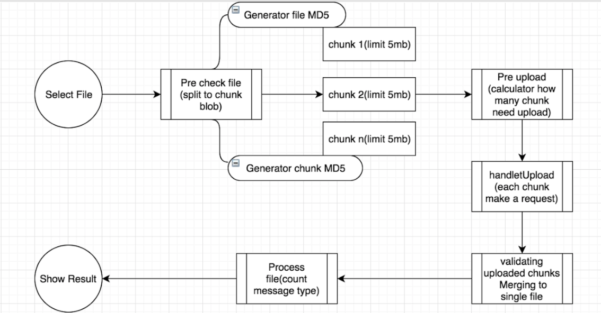
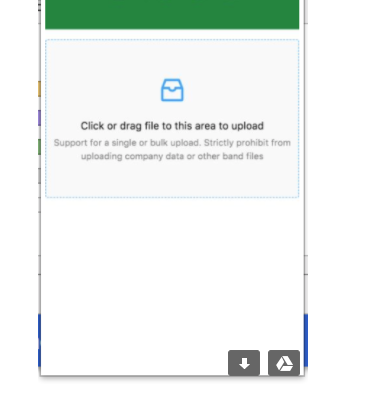
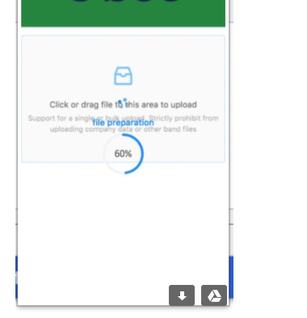
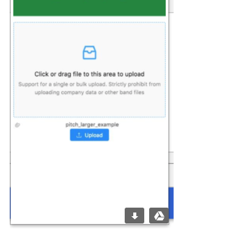
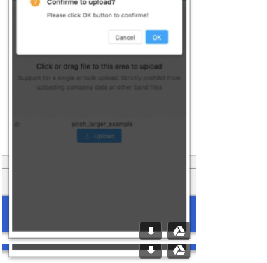
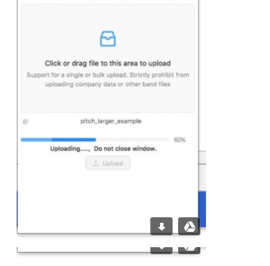
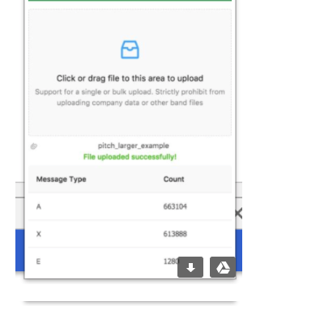

# react-upload-demo

## Getting Started

Pre require: Node V8 and Yarn

#1. go to cboe-server folder run
    yarn install
    yarn run start

#2. go to cboe-upload folder run
    yarn install
    yarn run start
    

